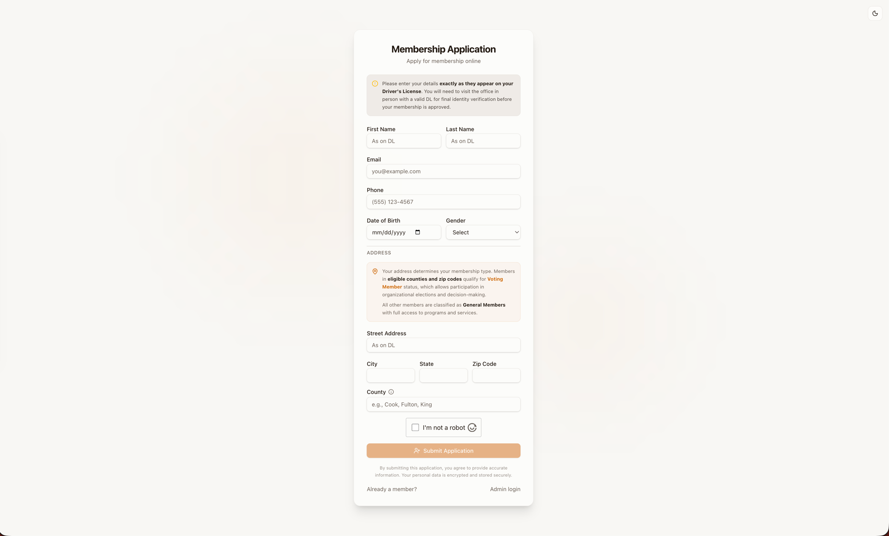
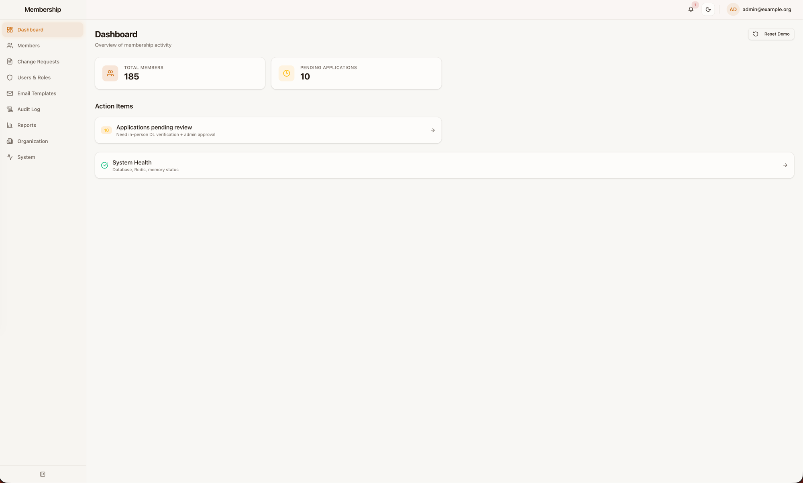
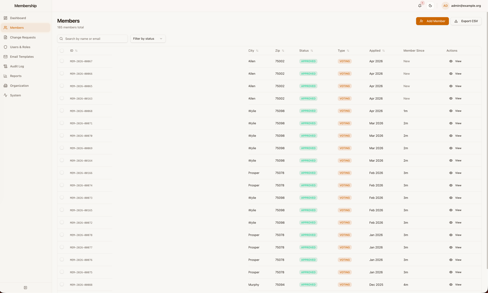
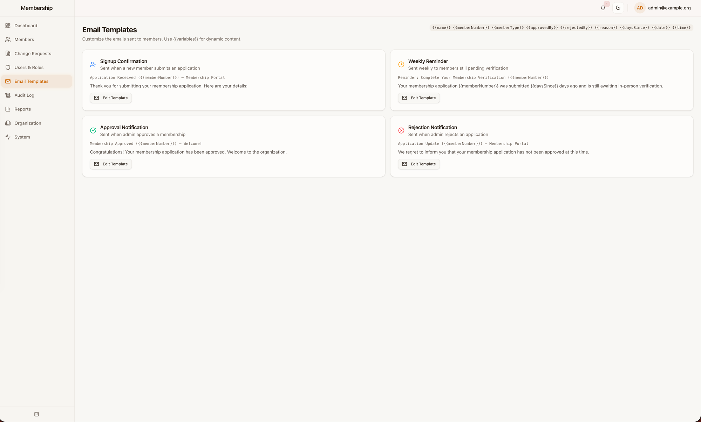
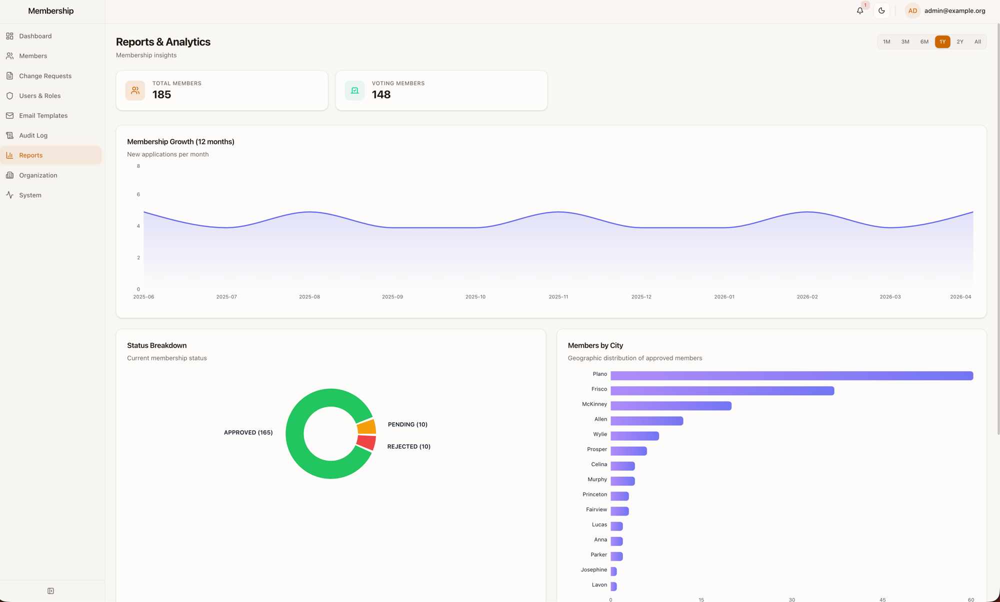
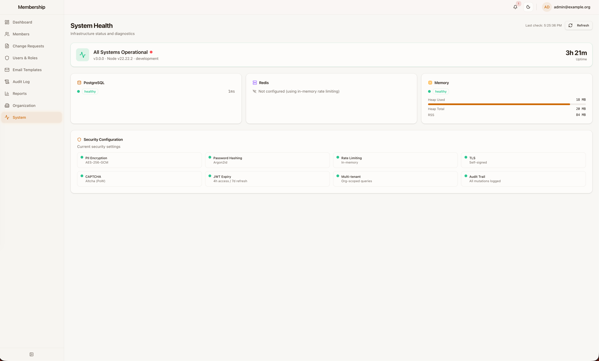
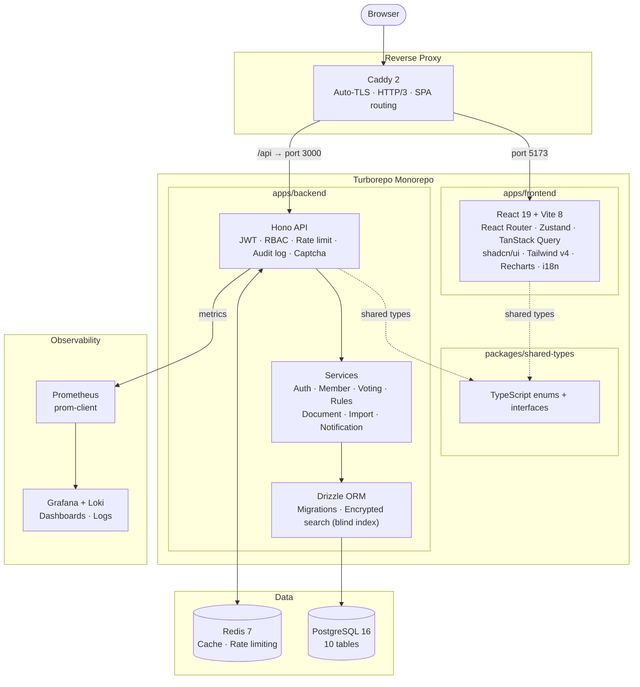

<div align="center">

# MemberVault

**Open-source, multi-tenant membership management - production-ready out of the box.**

[](LICENSE)
[](https://nodejs.org/)
[](https://www.typescriptlang.org/)
[](https://react.dev/)
[](https://hono.dev/)
[](https://orm.drizzle.team/)
[](https://www.postgresql.org/)
[](https://redis.io/)
[](https://docs.docker.com/compose/)
[](https://turbo.build/)
[](https://tailwindcss.com/)
[](https://ui.shadcn.com/)
[](https://playwright.dev/)
[](https://vitest.dev/)
[](https://github.com/pvnarp/membervault/pulls)

</div>

---

## What is MemberVault?

**MemberVault** started as a side project to help a few local organizations swap their Excel-based member tracking for something that didn't break every time someone edited the wrong column. What began as a simple CRUD app slowly became a personal curiosity: how far could you push a small project before things stopped holding together? JWT auth, encrypted PII at the app layer, fine-grained RBAC, event check-in with QR codes, observability, load tests. Each layer added less out of necessity and more out of wanting to see what "production-grade" actually looks like in practice.

When [Factory AI](https://factory.ai) crossed my path, the project became a test bench for something else entirely: a real-world evaluation of what agentic development tooling can actually do. The entire codebase was handed over for a full rearchitecture - monorepo structure, API surface design, security patterns, infrastructure wiring, and test coverage from scratch. This repo is the output of that experiment.

---

## Screenshots

<p align="center">
  
  <br/><em>Public membership application — address determines voting eligibility</em>
</p>

| | |
|---|---|
|  |  |
| *Admin dashboard — pending applications and action queue* | *Member directory — searchable, filterable, CSV export* |

| | |
|---|---|
|  |  |
| *Email template editor with variable interpolation* | *Reports — membership growth, status breakdown, geographic distribution* |

<p align="center">
  
  <br/><em>System health — DB, Redis, memory, and security configuration status</em>
</p>

---

## Architecture



---

## Features

### Member Management
- Registration with magic-link and admin login flows
- Profile management with admin-approved name/address changes
- Eligibility rules configurable by county and zip code
- CSV bulk import/export with server-side validation and formula injection protection
- QR code generation per member for event check-in

### Administration
- 5-role RBAC: Super Admin, Membership Manager, Viewer, Member, Event Volunteer
- Permission matrix UI showing exactly what each role can access
- Dashboard with membership stats, alerts, and action-item queue
- Analytics and reporting with interactive charts, time-range filter, and drill-down
- In-app notification system with real-time bell icon
- Eligibility rule management (county + zip)
- Full audit log for all admin actions
- Change request approval queue
- Email template management with variable interpolation
- System health dashboard (DB, Redis, memory, security config)

### Events and Check-In
- Event management with multi-date support
- Event Volunteer role: temporary scoped accounts for day-of helpers, auto-expire on finalization
- Live check-in screen with counter, progress bar, instant search, undo last scan, and print roster
- QR code barcode-style check-in
- Member photos for identity verification during check-in

### Observability
- Prometheus metrics: HTTP latency, error rate, Node.js runtime, business metrics
- Pre-provisioned Grafana dashboards (application, system, business KPIs)
- Loki + Promtail log aggregation
- Deep readiness health check (`/health/ready`) covering DB, Redis, and memory pressure
- Structured JSON logging with pino and request ID correlation

### Security
- AES-256-GCM encryption for all PII at the application layer - never stored raw
- Encrypted search via HMAC blind index (no full-table decryption required)
- JWT authentication with refresh tokens (jose)
- Argon2 password hashing
- Altcha proof-of-work captcha (open source, self-hosted, no third-party tracking)
- Redis-backed rate limiting with in-memory fallback
- CORS, secure headers, full audit trail

### Infrastructure
- Caddy reverse proxy with automatic HTTPS (Let's Encrypt) and HTTP/3
- PostgreSQL automated backups: 7-day daily + 4-week weekly retention
- Production Docker Compose with resource limits, log rotation, and health checks
- Monitoring overlay (Prometheus + Grafana + Loki + Promtail)

### Developer Experience
- Turborepo monorepo with shared types, build caching, and parallel task execution
- Playwright E2E tests (5 suites: auth, members, voting, member-portal, admin - cross-browser + mobile)
- k6 load tests (smoke, average-load, stress scenarios with p95 and error-rate thresholds)
- 156+ Vitest unit/integration tests
- MSW for frontend API mocking in tests
- i18n via react-i18next (multi-language ready)
- Guided onboarding tours (driver.js) for new admin and member users
- Mobile-responsive with hamburger nav, card-view tables, and touch-friendly UI

---

## Tech Stack

| Layer | Technology |
|-------|------------|
| **Backend** | [Hono 4.7](https://hono.dev) · [Drizzle ORM](https://orm.drizzle.team) · PostgreSQL 16 · Zod · jose · pino · prom-client · ioredis · Altcha |
| **Frontend** | [React 19](https://react.dev) · [Vite 8](https://vite.dev) · [shadcn/ui](https://ui.shadcn.com) · Tailwind CSS 4 · Zustand · TanStack Query · Recharts · react-i18next |
| **Auth** | JWT (jose) · Argon2 · TOTP (otplib) · Altcha PoW captcha |
| **Infra** | Docker Compose · [Caddy 2](https://caddyserver.com) · Redis 7 · [Turborepo 2.x](https://turbo.build) |
| **Observability** | Prometheus · Grafana · Loki · Promtail |
| **Testing** | Vitest · Playwright · k6 · Testing Library · MSW |
| **Shared** | `packages/shared-types` (TypeScript enums + interfaces) |

---

## Project Structure

```
membervault/
├── apps/
│   ├── backend/                     # Hono REST API (port 3000)
│   │   └── src/
│   │       ├── routes/              # auth, members, voting, rules, documents,
│   │       │                        #   admin, audit, cron, reports, notifications
│   │       ├── services/            # Business logic layer
│   │       ├── middleware/          # JWT, RBAC, rate-limit, audit, captcha
│   │       ├── db/                  # Drizzle schema, migrations, seed
│   │       ├── lib/                 # Encryption, email, errors, logger, redis, metrics
│   │       └── validators/          # Zod schemas
│   └── frontend/                    # React SPA
│       └── src/
│           ├── pages/               # admin/ · member/ · public/ views
│           ├── components/          # DataTable, StatCard, NotificationBell, shadcn/ui
│           ├── layouts/             # AdminLayout (sidebar + mobile drawer), MemberLayout
│           ├── stores/              # Zustand (auth)
│           ├── i18n/                # react-i18next config + locale files
│           └── lib/                 # API client, utilities
├── packages/
│   └── shared-types/                # Shared TypeScript types (enums + interfaces)
├── docker/
│   ├── monitoring/                  # Prometheus, Grafana, Loki, Promtail configs
│   ├── postgres/                    # init.sql (audit triggers)
│   └── scripts/                     # backup.sh, restore.sh
├── docs/
│   ├── architecture.md              # System architecture diagram (Mermaid)
│   └── screenshots/                 # UI screenshots
├── e2e/                             # Playwright E2E test suites
├── load-tests/                      # k6 smoke / average / stress scenarios
├── docker-compose.yml               # Base stack
├── docker-compose.dev.yml           # Development (hot reload)
├── docker-compose.prod.yml          # Production (Redis, backups, resource limits)
├── docker-compose.monitoring.yml    # Observability overlay
├── docker-compose.test.yml          # Isolated E2E test environment
└── turbo.json
```

---

## Getting Started

### Prerequisites

- [Docker](https://docs.docker.com/get-docker/) and Docker Compose v2
- [Node.js](https://nodejs.org/) >= 22 (for local development without Docker)

### Docker (recommended)

```bash
git clone https://github.com/pvnarp/membervault.git
cd membervault

# Copy and configure environment
cp .env.example .env
# Edit .env - set passwords, JWT secrets, ENCRYPTION_KEY, and RESEND_API_KEY

# Start development stack (hot reload enabled)
docker compose -f docker-compose.dev.yml up --build
```

Open **http://localhost** and the app is running.

### Production Deployment

```bash
cp .env.production.example .env
# Edit .env - generate strong secrets (see env vars table below)

# Production stack (Redis, backups, log rotation)
docker compose -f docker-compose.prod.yml up --build -d

# Production + full observability (Grafana at :3001, Prometheus at :9090)
docker compose -f docker-compose.prod.yml \
  -f docker-compose.monitoring.yml up --build -d
```

### Local Development (no Docker)

```bash
npm install

# Start all services in parallel (backend :3000 + frontend :5173)
npm run dev

# Seed the database (from apps/backend/)
npm run db:seed
```

### Service Endpoints

| Service | Development | Production |
|---------|-------------|------------|
| App | http://localhost | https://yourdomain.com |
| API | http://localhost/api/v1 | https://yourdomain.com/api/v1 |
| Grafana | - | http://localhost:3001 |
| Prometheus | - | http://localhost:9090 |

---

## Demo Credentials

After running `npm run db:seed`, the following accounts are available:

| Role | Email | Password | Login URL |
|------|-------|----------|-----------|
| Super Admin | `admin@example.org` | `AdminPass123!` | `/admin/login` |
| Membership Manager | `manager@example.org` | `ManagerPass123!` | `/admin/login` |
| Viewer | `viewer@example.org` | `ViewerPass123!` | `/admin/login` |
| Member | `raj.patel2@example.com` | `MemberPass123!` | `/login` |

---

## Environment Variables

Copy `.env.example` for development or `.env.production.example` for production.

| Variable | Description |
|----------|-------------|
| `DATABASE_URL` | PostgreSQL connection string |
| `JWT_SECRET` | 64-char random string: `openssl rand -base64 48` |
| `JWT_REFRESH_SECRET` | 64-char random string, separate from JWT_SECRET |
| `ENCRYPTION_KEY` | 64-char hex string for AES-256-GCM: `openssl rand -hex 32` |
| `RESEND_API_KEY` | [Resend](https://resend.com) API key for transactional email |
| `ALTCHA_HMAC_KEY` | 32-char hex for Altcha PoW captcha: `openssl rand -hex 32` |
| `REDIS_URL` | Redis connection string (optional - enables Redis-backed rate limiting) |
| `DOMAIN` | Production domain, used by Caddy for automatic TLS |
| `VITE_API_URL` | Backend API URL as seen from the browser |

---

## Commands

```bash
# Root (Turborepo)
npm run dev                  # Start all dev servers in parallel
npm run build                # Build all packages
npm run test                 # Run all unit/integration tests
npm run lint                 # Lint all packages
npm run test:e2e             # Playwright E2E tests (headless)
npm run test:e2e:ui          # Playwright with interactive UI
npm run test:load:smoke      # k6 smoke (1 VU, 30s)
npm run test:load:average    # k6 average (50 VUs, 5min)
npm run test:load:stress     # k6 stress (ramp to 200 VUs)

# Database (from apps/backend/)
npm run db:seed              # Seed demo data
npx drizzle-kit generate     # Generate migration from schema changes
npx drizzle-kit migrate      # Apply migrations
npx drizzle-kit studio       # Open Drizzle Studio GUI

# Docker
docker compose -f docker-compose.dev.yml up --build
docker compose -f docker-compose.prod.yml up --build -d
docker compose -f docker-compose.test.yml up --build --abort-on-container-exit

# Backup and restore (production)
docker compose -f docker-compose.prod.yml exec backup /scripts/backup.sh
docker compose -f docker-compose.prod.yml exec backup /scripts/restore.sh /backups/FILE.sql.gz
```

---

## RBAC

MemberVault enforces five roles in strict hierarchy:

```
SUPER_ADMIN  >  MEMBERSHIP_MANAGER  >  VIEWER  >  MEMBER  >  EVENT_VOLUNTEER
```

- **Super Admin** - full system access, user management, configuration
- **Membership Manager** - member lifecycle, events, reporting
- **Viewer** - read-only access to member and event data
- **Member** - self-service portal, event check-in, voting
- **Event Volunteer** - temporary role scoped to one event; auto-expires on finalization

---

## Contributing

Issues and pull requests are welcome. Open an issue first to discuss significant changes before submitting a PR.

Use [Conventional Commits](https://www.conventionalcommits.org/) for commit messages: `feat:`, `fix:`, `chore:`, `docs:`, `test:`. Pre-commit hooks run lint-staged (ESLint + Prettier on staged files) automatically; pre-push hooks run the full test suite (backend + frontend) and build shared types.

---

## License

[MIT](LICENSE) - Copyright (c) 2026 Pavan Aripakula and MemberVault Contributors.
