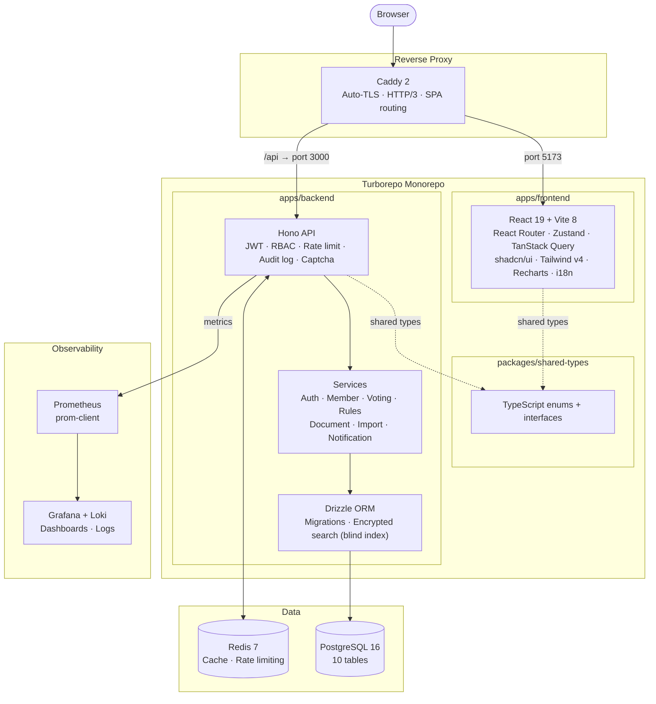

# MemberVault — Architecture



## Roles (RBAC)

```
SUPER_ADMIN > MEMBERSHIP_MANAGER > VIEWER > MEMBER > EVENT_VOLUNTEER
```

## Docker Compose targets

| File | Purpose |
|------|---------|
| `docker-compose.dev.yml` | Local development |
| `docker-compose.prod.yml` | Production (+ Redis, backups) |
| `docker-compose.monitoring.yml` | Observability overlay |
| `docker-compose.test.yml` | Playwright E2E environment |
